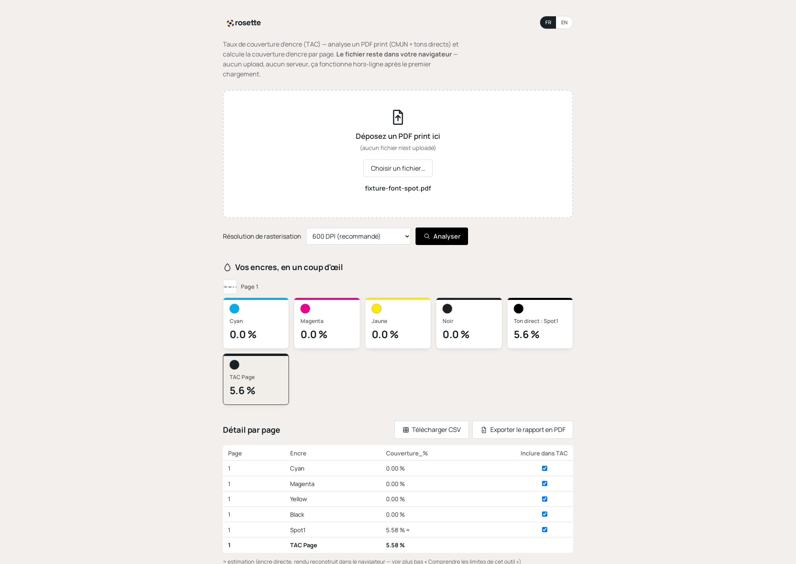

<picture>
  <source media="(prefers-color-scheme: dark)" srcset="docs/logo-ondark.png">
  
</picture>

[](https://www.juliensarrazin.fr/rosette/)


> **La rosette — la signature de l'offset**
>
> En impression CMJN, les quatre plaques tramées sont imprimées à des angles
> légèrement différents (C : 15°, M : 75°, J : 0°, N : 45°). Quand elles se
> superposent, les points forment un motif caractéristique appelé rosette.
> C'est la signature visuelle de l'impression offset. La « structure
> pointillée » reconnaissable d'un magazine ou d'un catalogue imprimé, c'est
> précisément cette rosette. Avec des angles mal choisis, le résultat est un
> moiré visible sur l'imprimé.

**Mesure du taux de couverture d'encre (TAC) d'un PDF print — 100% dans le
navigateur, zéro upload, zéro backend.**

Analyse un PDF d'impression (CMJN + tons directs) et calcule la couverture
d'encre par page, directement dans l'onglet du navigateur — le fichier ne
quitte jamais l'ordinateur. Pensé pour les graphistes et éco-concepteurs
packaging : cards colorées par encre, dashboard traduisant le taux d'encrage
en poids d'encre et empreinte carbone (d'après le
[Guide de l'éco-encrage, Citeo](https://bo.citeo.com/sites/default/files/2019-07/20190524_Citeo_Guide%20%C3%A9co-encrage_WEB.pdf)),
export CSV et rapport PDF, interface FR/EN.



## Pourquoi

Portage d'un script Python original (voir `docs/original-python-script.py`)
qui s'appuyait sur Ghostscript pour rasteriser un PDF en séparations
contone et calculer la couverture d'encre. Ce dépôt en fait une version
100% client, sans installation ni serveur : moteur de rendu
[MuPDF](https://mupdf.com/) compilé en WebAssembly, avec un décodeur de
contours de glyphes maison (TrueType/CFF) pour mesurer fidèlement les tons
directs — MuPDF n'exposant pas nativement de rendu "toutes séparations"
côté JavaScript. Voir `docs/prompt-original.md` pour le brief d'origine.

Contexte complet, démarche et limites : [« Mesurer le taux d'encrage : pourquoi la mesure « au point » ne suffit pas... »](https://www.juliensarrazin.fr/2026/02/01/mesurer-le-taux-dencrage-pourquoi-la-mesure-au-point-ne-suffit-pas-et-comment-obtenir-une-mesure-globale-exploitable/),
article publié le 1er février 2026 sur juliensarrazin.fr.

## Utilisation

Aucune installation requise pour l'utilisateur final : c'est un site
statique. Pour le lancer en local (développement/test) :

```bash
cd dev
docker compose up --build
# puis ouvrir http://localhost:8080
```

Documentation complète (architecture, déploiement sur hébergement mutualisé
OVH, personnalisation du thème/config.yml, limites connues, tests) :
[**webapp/README.md**](webapp/README.md).

## Licence

Ce dépôt est distribué sous licence **AGPL-3.0-or-later** (voir
[LICENSE](LICENSE)) — imposée par l'intégration de [MuPDF](https://mupdf.com/)
(Artifex Software), lui-même sous AGPL. Détail des composants tiers et de
leurs licences : [THIRD-PARTY-NOTICES.md](THIRD-PARTY-NOTICES.md).

## Crédits

Conçu par [Julien Sarrazin](https://www.juliensarrazin.fr/), designer
graphique packaging. Développé avec l'assistance de l'IA (Claude Code) —
voir le pied de page de l'application.

## Prochaines étapes

- Amélioration des rapports PDF (mise en page).
- Amélioration de l'aperçu de page (miniatures).
- Calcul du TAC total, toutes pages réunies, pour un même PDF.
- Calcul de l'empreinte carbone pour la totalité du TAC (toutes pages
  réunies) d'un même PDF.
